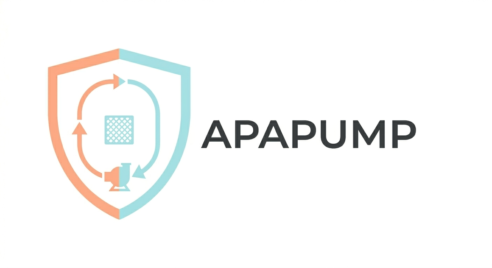

# APAPUMP

<p align="center">

</p>

**Autonomous filtration pump controller for APA Devices pool automation**
· 
· 

---

## Key Features

### Pump control
- PCF8574AT I2C relay expander (default) or direct Arduino GPIO — one constructor covers both
- Non-blocking state machine: IDLE → STARTING → RUNNING → STOPPING
- Safe boot: all relays start OFF regardless of previous relay or pin state
- Manual override: `FORCE_ON`, `FORCE_OFF`, `AUTO` — with optional timeout or midnight auto-return
- Extension relay outputs on PCF P4–P7 for lights or extra equipment

### Scheduling and daily tracking
- Schedule callback drives pump on/off without any external library
- Daily runtime target with catch-up logic and optional time window
- Midnight rollover via RTC epoch callback or 24-hour millis() fallback

### Follower devices
- **UVC sanitizer** — ON before pump, OFF after (configurable pre/post delay)
- **AUX device** (heat pump, ozone, etc.) — ON after pump, OFF before pump stops
- **Solar valve** — opens when solar drives the pump; instantly closes in manual mode

### Solar heating
- Absorber–pool temperature dead-band hysteresis (configurable start/stop deltas)
- Pool cooling: runs in reverse when pool temperature exceeds maximum
- Day/night boundary gate via RTC epoch callback
- **Solar safety (Priority 0):** absorber too hot → pump ON + valve OPEN, overrides even `FORCE_OFF`

### Safety alarms
- **Overcurrent** — EMA-learned baseline × 1.5 threshold; cold-start gate of 5 samples
- **Dry-run** — pressure below EMA baseline × 40% (or absolute minimum before EMA builds)
- **Overpressure** — absolute hard limit at `maxPressure` AND EMA-relative dirty-filter detection
- **Freeze protection** — pool temp below 4.5 °C → continuous run; suppressed if dry-run detected
- **No-flow stub** — flow switch confirmed after settle; hardware-ready for future sensor
- All alarms are latching — explicit `acknowledgeAlarm()` required

### Engineering
- **564 B SRAM** on Mega 2560 with all features registered
- 23 boolean flags packed into 3 bytes; all string literals in flash (`F()` macro)
- EEPROM: 12 bytes, magic + version + checksum validation, persists target and clean pressure
- Zero `delay()` calls — every path returns within one `loop()` iteration
- Designed to integrate with APADOSE and APALCDGUI via callback bridges — no coupling

---

## Installation

**Arduino IDE:** Sketch → Include Library → Add .ZIP Library → select the APAPUMP folder.

**PlatformIO:**
```ini
lib_deps =
    https://github.com/apadevices/APAPUMP
```

---

## What It Does

APAPUMP controls a pool filtration pump and up to three follower devices (UVC lamp, AUX device, solar valve) through a PCF8574AT I2C relay expander or direct Arduino output pins. Each call to `update()` in your `loop()` advances the state machine, checks every safety guard in priority order, and fires alarm callbacks when something is wrong — all without blocking.

Out of the box, the zero-arg constructor targets the APA Devices HMI board v1.0: PCF8574AT at 0x3C with pump on P0, UVC on P1, AUX on P2, and solar valve on P3. Every optional feature is **disabled by default** and activated with one method call.

---

## How It Works

### State machine

```
                                ┌─────────────────────────────────┐
                                │           pump.begin()           │
                                ▼                                   │
                             [ IDLE ]                               │
                                │                                   │
                   _shouldPumpRun() = true                          │
                   min OFF time OK (60 s)                           │
                                │                                   │
                          [ STARTING ]                              │
                                │                                   │
                   UVC pre-delay (default 5 s)                      │
                                │                                   │
                          [ RUNNING ] ◄── safety alarms checked:   │
                                │         current · pressure ·     │
                                │         flow · freeze            │
                   _shouldPumpRun() = false                         │
                   min run time OK (300 s)                          │
                                │                                   │
                         [ STOPPING ]                               │
                                │                                   │
          AUX lead ──► pump OFF ──► UVC post-delay ────────────────┘
```

**Guards that bypass min-run time:** `FORCE_ON` and `FORCE_OFF` — manual mode suspends timing guards.

### Follower timing

```
Time →    0         5s         15s       [pump runs…]   Ts-30s    Ts      Ts+30s
          │          │          │                │        │         │        │
UVC:      ├──ON──────┼──────────┼────────────────┼────────┼─────────┼──OFF───┤
Pump:               ON──────────────────────────────────OFF
AUX:                           ON───────────────OFF
          ◄─ pre ──►◄──────────────── RUNNING ──────────►◄─ lead ─►◄─ post─►
```

`Ts` = moment the stop sequence begins. `pre` = `enableUVC(preDelayS, …)`. `lead` = `enableAux(…, stopLeadS)`. `post` = `enableUVC(…, postDelayS)`.

### Priority engine

Every `update()` tick calls the priority engine. The first rule that matches wins:

| Priority | Condition | Result |
|----------|-----------|--------|
| **P0** | Solar absorber > safety temp (default 50 °C) | Pump ON + valve OPEN — overrides FORCE_OFF |
| **P1** | `FORCE_OFF` manual mode | Pump OFF |
| **P2** | `FORCE_ON` manual mode | Pump ON |
| **P3** | External request callback returns `true` | Pump ON |
| **P4** | Freeze: pool temp < threshold AND water present | Pump ON |
| **P5a** | Solar: absorber > pool + startDelta | Pump ON (hysteresis) |
| **P5b** | Catch-up: daily runtime < daily target (window OK) | Pump ON |
| **P5c** | Schedule callback returns `true` | Pump ON |
| — | None of the above | Pump OFF |

### PCF relay layout (APA HMI board v1.0 defaults)

```
PCF8574AT at I2C address 0x3C
│
├─ P0 ── Pump relay              (always required)
├─ P1 ── UVC relay               (optional — enableUVC())
├─ P2 ── AUX relay               (optional — enableAux())
└─ P3 ── Solar valve relay       (optional — enableSolar(…, useValve=true))
│
├─ P4 ── Extension relay         (optional — setExtraOutput(4, on/off))
├─ P5 ── Extension relay         (optional — setExtraOutput(5, on/off))
├─ P6 ── Extension relay         (optional — setExtraOutput(6, on/off))
└─ P7 ── Extension relay         (optional — setExtraOutput(7, on/off))
```

PCF HIGH = relay ON, LOW = relay OFF. `begin()` writes `0x00` immediately — all relays start OFF.

---

## Quick Start

### Minimal — APA HMI board defaults (zero wiring, zero config)

```cpp
#include <Wire.h>
#include <APAPUMP.h>

ApaPump pump;              // PCF at 0x3C — pump=P0, uvc=P1, aux=P2, valve=P3

void setup() {
    Wire.begin();          // required for PCF mode — call before pump.begin()
    pump.begin();          // all relays OFF, EEPROM loaded
}

void loop() {
    pump.update();         // non-blocking — call every loop()
}
```

### Alternative: direct GPIO

```cpp
// Active-high relay (most modules)
ApaPump pump(RELAY_DIRECT, 7);               // pump on pin 7

// Active-low relay (some modules)
ApaPump pump(RELAY_DIRECT, 7);
pump.setActiveLow();             // call BEFORE pump.begin()

// Multiple relays, direct GPIO
ApaPump pump(RELAY_DIRECT, 7, 8, 9, 10);    // pump=7, uvc=8, aux=9, valve=10
```

### Scheduled pump with alarm feedback

```cpp
#include <Wire.h>
#include <APAPUMP.h>

ApaPump pump;

bool scheduleActive() {
    // return true when your RTC time falls inside a timer slot
    return false;  // replace with real logic
}

void onAlarm(PumpAlarm alarm) {
    if (alarm == PUMP_ALARM_NONE) return;   // alarm was cleared
    Serial.print(F("Pump alarm: "));
    switch (alarm) {
        case PUMP_ALARM_OVERCURRENT:   Serial.println(F("overcurrent"));   break;
        case PUMP_ALARM_LOW_PRESSURE:  Serial.println(F("dry run"));       break;
        case PUMP_ALARM_HIGH_PRESSURE: Serial.println(F("high pressure")); break;
        case PUMP_ALARM_NO_FLOW:       Serial.println(F("no flow"));       break;
        default: break;
    }
    // pump continues running — call pump.acknowledgeAlarm() when investigated
}

void setup() {
    Wire.begin();
    pump.begin(scheduleActive);             // schedule drives on/off
    pump.enableUVC(5, 30);                  // UVC: 5 s pre, 30 s post
    pump.enableAux(10, 30);                 // AUX: 10 s delay, 30 s lead
    pump.setPumpAlarmCallback(onAlarm);
}

void loop() { pump.update(); }
```

---

## Manual Override

Force the pump on or off at any time. All timing guards and schedules are suspended:

```cpp
pump.setManualMode(FORCE_ON);   // force pump ON  (e.g. vacuuming, winterising)
pump.setManualMode(FORCE_OFF);  // force pump OFF (e.g. plumbing, service)
pump.setManualMode(AUTO);       // return to automatic control
```

**The solar valve closes immediately when entering FORCE_ON** — operator gets full system pressure.

**Auto-return options** — pick one or both:

```cpp
// Timeout: returns to AUTO after 60 minutes
ApaPump pump(RELAY_PCF, 0x3C, 0, 1, 2, 3, 60);   // 6th constructor parameter
pump.setManualTimeout(60);                           // or set at any time

// Midnight reset (requires setMidnightCallback())
pump.setManualAutoReset(true);
```

**Note:** Solar safety (P0) still applies even in `FORCE_OFF`. If the absorber reaches the safety temperature, the pump runs to prevent heat damage regardless of manual mode.

---

## Followers: UVC, AUX, Solar Valve

Each follower is independent and optional. Wire the relay to the corresponding PCF bit (or GPIO pin), then call the enable method:

```cpp
// UVC lamp: ON 5 s before pump, OFF 30 s after pump stops
pump.enableUVC(5, 30);

// AUX device (heat pump, ozone): ON 10 s after pump starts, OFF 30 s before pump stops
pump.enableAux(10, 30);

// Solar valve: open when solar logic drives the pump
// useValve=true enables the valve relay on P3 (or direct pin d)
pump.enableSolar(absorberTempCb, poolTempCb, /*useValve=*/true, ...);
```

**UVC pre-delay** — when a pre-delay is configured, the pump enters STARTING state while UVC warms up. If the reason to start disappears during STARTING (e.g. schedule ends), the sequence is cancelled cleanly — UVC turns off and the pump never fires.

---

## Solar Heating

Solar logic becomes the **sole on/off driver** when enabled — the schedule callback is only used for the daily runtime target.

```cpp
pump.enableSolar(
    []() { return adc.getSolarTemp(); },   // absorber temperature callback
    []() { return adc.getPoolTemp(); },    // pool temperature callback (optional)
    true,                                  // useValve — open valve when solar running
    8.0f,                                  // startDelta: start when absorber > pool + 8°C
    3.0f,                                  // stopDelta:  stop  when absorber < pool + 3°C
    32.0f,                                 // maxPoolTemp: pool cooling if pool > 32°C
    2.0f,                                  // coolDelta: cool when absorber < pool - 2°C
    50.0f                                  // safetyTemp: force pump ON if absorber > 50°C
);

// Optional: restrict solar heating to daytime hours
pump.setSolarDayNight(
    []() { return rtc.getEpoch(); },       // Unix epoch callback
    7,                                     // daytime starts at 07:00
    20                                     // daytime ends at 20:00
);
```

### Solar hysteresis

```
Absorber temp
     │
     │                     START threshold = pool + startDelta
─────┼──────────────────────────────────────────────────────
     │   ← pump ON                               pump ON →
     │
─────┼──────────────────────────────────────────────────────
     │                     STOP threshold = pool + stopDelta
     │
```

The gap between start and stop thresholds prevents rapid on/off cycling when temperature hovers near the boundary. Increase `startDelta − stopDelta` for wider hysteresis.

---

## Daily Runtime Target and Catch-Up

```cpp
// Option A: fixed target (user sets it once)
pump.setDailyTarget(360);                   // run 6 hours per day

// Option B: use the APALCDGUI timer sum as the target
pump.begin(scheduleActive, nullptr,
           []() { return gui.getTimerTotalMinutes(); });

// Query progress
uint16_t ran = pump.getDailyRuntimeMinutes();
bool     met = pump.isDailyTargetMet();
```

When solar is enabled and the daily target is not met, catch-up runs until the target is reached:

```cpp
// Optional: limit catch-up to daytime hours (requires setMidnightCallback)
pump.setCatchupWindow(8, 20);   // catch-up only between 08:00 and 20:00
```

---

## Safety Alarms

All alarms are **latching** — the pump does not stop automatically (your `alarmCb` decides the action). Call `acknowledgeAlarm()` after investigation to clear.

| Alarm | Triggers when | Requires |
|-------|--------------|----------|
| `PUMP_ALARM_OVERCURRENT` | current > learned baseline × 1.5 | `setCurrentCallback()` |
| `PUMP_ALARM_LOW_PRESSURE` | pressure below 40% of EMA baseline (dry-run) | `enablePressure()` |
| `PUMP_ALARM_HIGH_PRESSURE` | pressure > `maxPressure` OR > EMA × (1+peakPct%) | `enablePressure()` + `setPressurePeakAlarm()` |
| `PUMP_ALARM_NO_FLOW` | flow switch reports no flow after 30 s settle | `setFlowCallback()` |

**Alarm callback pattern:**

```cpp
pump.setPumpAlarmCallback([](PumpAlarm alarm) {
    if (alarm == PUMP_ALARM_NONE) {
        // alarm was acknowledged — update LCD, clear indicator
        gui.cancelActiveAlert();
        return;
    }
    // alarm fired — notify operator
    gui.postActiveAlert(F("Pump alarm!"), F("Check equipment"),
                        ALERT_CRITICAL, []() { pump.acknowledgeAlarm(); });
});
```

### Dry-run protection

When `enablePressure()` is registered, APAPUMP builds a dual pressure baseline (EMA): one for normal running, one for when the solar valve is open (higher pressure expected due to absorber resistance). After 5 pump runs, if pressure stays near zero after 30 s, `PUMP_ALARM_LOW_PRESSURE` fires.

Before the EMA baseline builds (first 5 runs), an absolute minimum of 0.1 bar is used.

### Freeze protection

```cpp
pump.enableFreezeProtection(
    []() { return adc.getPoolTemp(); },   // pool/pipe temperature
    4.5f                                  // threshold in °C (default)
);
```

When pool temperature drops below the threshold, the pump runs continuously to prevent pipes from freezing. **Dry-run interlock:** if the pressure sensor is enabled, calibrated, and indicates no water in the pipes (pressure near zero), freeze protection is suppressed — forcing the pump without water would burn the motor.

---

## Integrating with APADOSE and APALCDGUI

APAPUMP, APADOSE, and APALCDGUI are independent libraries — your sketch is the bridge. No library knows about the others.

### Bridge: APALCDGUI timer → APAPUMP schedule

```cpp
// In begin(): pass a lambda that reads the timer state from the GUI
pump.begin(
    []() {
        // return true when current time falls inside any timer slot
        uint16_t nowMin = rtcHour * 60 + rtcMinute;
        for (uint8_t i = 0; i < APA_LCD_MAX_TIMERS; i++) {
            if (gui.isTimerEnabled(i) &&
                nowMin >= gui.getTimerStart(i) &&
                nowMin <  gui.getTimerEnd(i)) return true;
        }
        return false;
    },
    nullptr,
    []() { return gui.getTimerTotalMinutes(); }  // daily target from timer sum
);
```

### Bridge: APADOSE post-shock → APAPUMP

```cpp
// After a shock dose, run the pump for 4 hours to circulate the chlorine.
// Uses the externalRequestCb — no new API needed.

static uint32_t postShockUntil = 0;

pump.begin(scheduleCb,
    []() {
        // Shock is running: extend the post-shock window
        if (dose1.isShockActive()) {
            postShockUntil = millis() + 4UL * 3600UL * 1000UL;
            return true;
        }
        // Pump on until post-shock window expires
        return (millis() < postShockUntil);
    }
);
```

### Bridge: pump manual mode → APALCDGUI status indicator

```cpp
// Show [M] in the LCD corner whenever the pump is in manual mode
pump.setStatusCallback([](const __FlashStringHelper* msg) {
    if (pump.getManualMode() != AUTO) gui.setStatusIndicator('M');
    else                              gui.clearStatusIndicator();
    // Also forward the status text to a scrolling message area
    Serial.println(msg);
});
```

### Bridge: APASENSE → APAPUMP (pressure and current)

```cpp
// Order: adc.begin() BEFORE pump.begin() — pressure auto-zeros on first pump stop.
// pressureCb returns -1.0f while APASENSE is uncalibrated — APAPUMP skips
// all pressure logic until a valid reading arrives.

adc.begin();    // zero-cal requires pump off — call first

pump.begin();
pump.enablePressure(
    []() { return adc.getPressure(); },    // -1.0f until calibrated
    4.0f                                   // absolute max pressure (bar)
);
pump.setCurrentCallback([]() { return adc.getCurrent(); });

// Bridge: tell APASENSE when pump state changes so it can re-zero on pump stop
pump.setPumpStateCallback([](bool on) { adc.onPumpState(on); });
```

---

## Examples

| Sketch | Level | Description |
|--------|-------|-------------|
| `examples/01_minimal/` | Basic | PCF or GPIO, manual override via Serial, all three constructor options |
| `examples/02_scheduler/` | Intermediate | APALCDGUI timer schedule, UVC + AUX followers, alarm → active alert bridge |
| `examples/03_solar_freeze/` | Advanced | Solar heater + solar valve, freeze protection, pressure safety, APADOSE post-shock bridge |

---

## Platform Verification

Compiled with the `01_minimal` example. Zero errors, zero library warnings on all platforms.

| Platform | Board | RAM used | RAM total | Flash used | Flash total |
|----------|-------|----------|-----------|------------|-------------|
| Arduino Mega 2560 | ATmega2560 | 564 B | 8 192 B (6.9%) | 11 860 B | 253 952 B (4.7%) |
| Arduino Uno | ATmega328P | 564 B | 2 048 B (27.5%) | 11 094 B | 32 256 B (34.4%) |
| ESP32 DevKit | ESP32 | 22 024 B | 327 680 B (6.7%) | 290 493 B | 1 310 720 B (22.2%) |
| ESP8266 D1 Mini | ESP8266 | 28 852 B | 81 920 B (35.2%) | 274 147 B | 1 044 464 B (26.2%) |
| STM32 Bluepill | STM32F103C8 | 2 628 B | 20 480 B (12.8%) | 25 984 B | 65 536 B (39.6%) |

> The Uno row uses 27.5% RAM — that is the library with all Phase 2 features **registered** in the example. A minimal sketch (no solar, no pressure, no freeze) sits below 20%. ESP32 and ESP8266 totals include the full Arduino framework regardless of use.

---

## EEPROM Layout

APAPUMP reserves **12 bytes** starting at `APAPUMP_EEPROM_ADDR` (default 520).

### Field map

| Address | Bytes | Field | Saved when |
|---------|-------|-------|-----------|
| 520 | 2 | Magic `0xA55A` | — validity marker |
| 522 | 1 | Config version | — mismatch resets all fields to defaults |
| 523 | 2 | Daily target (minutes) | `setDailyTarget()` |
| 525 | 2 | Yesterday's runtime (minutes) | Midnight rollover (once per day) |
| 527 | 2 | Minimum run time (seconds) | `setMinRunTime()` |
| 529 | 2 | Clean pressure × 100 (bar; 0 = not learned) | `learnCleanPressure()` / `setCleanPressure()` |
| 531 | 1 | Checksum (byte sum of bytes 520–530) | — corruption guard |

### Write protection and EEPROM lifespan

`_saveEEPROM()` writes the full 12-byte struct, but a physical write only occurs when a byte has actually changed:

- **AVR (Uno/Mega):** `EEPROM.put()` calls `EEPROM.update()` per byte — reads first, writes only if value differs.
- **ESP32/ESP8266:** `EEPROM.put()` updates a RAM buffer; `EEPROM.commit()` compares the buffer to flash before writing — no flash write if content unchanged.
- **STM32:** EEPROM emulation with compare-before-write.

**Practical write frequency** (worst case on a running system):

| Event | Max frequency | Cycles used at 100 k limit |
|-------|--------------|---------------------------|
| Midnight rollover | 1 per day | 100 k days ≈ 273 years |
| `learnCleanPressure()` | Operator action | Negligible |
| `setMinRunTime()` from `setup()` | 0 physical writes if value unchanged | None |
| First boot / corruption recovery | Once | 1 cycle |

**Corruption recovery:** the checksum is verified on every `begin()`. If power fails mid-write and data is corrupted, the mismatch is detected on the next boot, factory defaults are loaded, and a clean struct is written.

### Override base address

```cpp
// Define before #include if the default conflicts with another library in your project:
#define APAPUMP_EEPROM_ADDR  532
#include <APAPUMP.h>
```

### APA EEPROM address map

All ranges across the APA library suite — free blocks shown explicitly:

| Range | Bytes | Status | Owner |
|-------|-------|--------|-------|
| 0–127 | 128 | **free** | — |
| 128–177 | 50 | used | APAPHX2_ADS1115 (sensor calibration) |
| 178–188 | 11 | **free** | — |
| 189–191 | 3 | used | APADOSE global (pool volume, dead-band) |
| 192–279 | 88 | used | APADOSE per-pump config (22 bytes × up to 4 instances) |
| 280–499 | 220 | **free** | — |
| 500–501 | 2 | used | APALCDGUI brightness |
| 502–508 | 7 | used | APALCDGUI timer slots (default 3 slots) |
| 509–519 | 11 | **free** | — gap before APAPUMP ¹ |
| **520–531** | **12** | **used** | **APAPUMP** |
| 532– | — | **free** | — |

> ¹ When `APA_LCD_MAX_TIMERS=6` the timer block extends to 514, leaving a 5-byte gap (515–519) before APAPUMP. This gap is intentional — do not place anything in 515–519 to keep the gap safe regardless of timer configuration.

---

## License

**Dual license — see LICENSE file for full terms.**

| Use | License |
|-----|---------|
| Personal, private, educational, hobby | Free — no charge, no paperwork |
| Commercial (products, services, OEM) | Separate written license required |

Commercial use includes selling or distributing hardware with this software, providing paid pool automation services, or integrating it into any revenue-generating product or system.

To obtain a commercial license: [kecup@vazac.eu](mailto:kecup@vazac.eu)

---

*APAPUMP — APA Devices · [kecup@vazac.eu](mailto:kecup@vazac.eu)*
